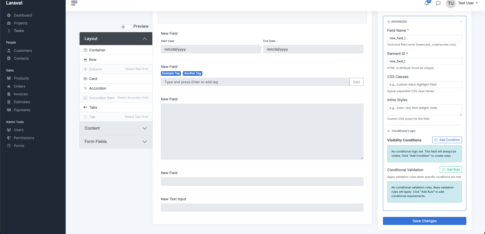

# Conditional Logic Guide

**Master advanced form behavior with visual conditional logic in Slick Forms**

Conditional logic allows you to show/hide fields and apply validation rules based on other field values - all without writing code. Slick Forms provides a visual interface with 91 field-type specific operators and AND/OR logic support.

---

## Table of Contents

- [Overview](#overview)
- [Visual Field Picker](#visual-field-picker)
- [Operators by Field Type](#operators-by-field-type)
- [AND/OR Logic](#andor-logic)
- [Conditional Visibility](#conditional-visibility)
- [Conditional Validation](#conditional-validation)
- [Real-World Examples](#real-world-examples)
- [Best Practices](#best-practices)
- [Troubleshooting](#troubleshooting)

---

## Overview

### What is Conditional Logic?

Conditional logic lets you create dynamic forms that adapt based on user input. Common use cases:

- **Show "Other" field** when user selects "Other" from dropdown
- **Hide sections** until user opts in
- **Apply validation** only when certain conditions are met
- **Multi-step disclosure** forms (progressive disclosure)
- **Dynamic form sections** based on user type

### Key Features

✅ **Visual Field Picker** - Eyedropper tool to select target fields
✅ **91 Operator Mappings** - Field-type specific operators
✅ **AND/OR Logic** - Combine multiple conditions
✅ **Real-time Evaluation** - Instant show/hide with Livewire
✅ **Conditional Validation** - Rules that only apply when conditions are met
✅ **Layout Element Support** - Show/hide containers, cards, tabs, etc.

---

## Visual Field Picker

The visual field picker makes selecting target fields effortless.

### How to Use

1. **Open Field Properties** - Click on a field to edit its properties
2. **Navigate to Advanced Tab** - Find "Conditional Logic" section
3. **Add Condition** - Click "Add Condition" button
4. **Click Eyedropper Icon** 👁️ - Enters field picker mode
5. **Hover Over Fields** - Fields on canvas highlight green
6. **Click Field** - Selected field populates as target



### Picker Mode Features

- **Crosshair Cursor** - Indicates you're in picker mode
- **Green Highlight** - Fields highlight on hover
- **Cancel Anytime** - Press Escape or click Cancel
- **Auto-Populate** - Selected field automatically fills dropdown

---

## Operators by Field Type

Slick Forms provides **91 total operator mappings** across all field types. Operators are contextual - you only see operators that make sense for the target field type.

### Text Fields (Text, Textarea, Email, URL)

**12 operators:**

| Operator | Description | Example |
|----------|-------------|---------|
| `equals` | Exact match | Name equals "John" |
| `not_equals` | Not exact match | Name not equals "Guest" |
| `contains` | Contains text | Email contains "@gmail" |
| `not_contains` | Doesn't contain text | Email not contains "@test" |
| `starts_with` | Begins with text | URL starts with "https://" |
| `ends_with` | Ends with text | Email ends with ".com" |
| `regex` | Regex pattern | Phone regex "/\d{10}/" |
| `is_empty` | Field is empty | Comments is empty |
| `is_not_empty` | Field has value | Address is not empty |
| `length_equals` | Length equals number | Code length equals 6 |
| `length_greater` | Length greater than | Password length greater 8 |
| `length_less` | Length less than | Bio length less 100 |

**Example Use Cases:**
- Show "Company Website" field when Email contains "@company"
- Require phone number when Comments not empty
- Show additional fields when Description length greater than 50

---

### Number Fields (Number, Slider, Star Rating)

**8 operators:**

| Operator | Description | Example |
|----------|-------------|---------|
| `equals` | Exactly equals | Age equals 18 |
| `not_equals` | Not equals | Quantity not equals 0 |
| `greater_than` | Greater than | Budget greater than 1000 |
| `less_than` | Less than | Age less than 65 |
| `greater_than_or_equal` | >= | Rating >= 4 |
| `less_than_or_equal` | <= | Quantity <= 100 |
| `is_empty` | No value entered | Price is empty |
| `is_not_empty` | Has value | Discount is not empty |

**Example Use Cases:**
- Show premium options when Budget greater than 5000
- Require additional info when Rating less than 3
- Hide fields when Quantity equals 0

---

### Date Fields (Date, Date Range, Time)

**8 operators:**

| Operator | Description | Example |
|----------|-------------|---------|
| `equals` | Same date | Start Date equals "2024-01-01" |
| `not_equals` | Different date | End Date not equals Start Date |
| `after` | After date | Event Date after "2024-12-31" |
| `before` | Before date | Birth Date before "2000-01-01" |
| `after_or_equal` | On or after | Check-in after or equal today |
| `before_or_equal` | On or before | Check-out before or equal +7 days |
| `is_empty` | No date selected | End Date is empty |
| `is_not_empty` | Date selected | Start Date is not empty |

**Example Use Cases:**
- Show early bird discount when Registration Date before "2024-06-01"
- Require explanation when End Date before Start Date
- Hide shipping options when Delivery Date is empty

---

### Selection Fields (Select, Radio)

**6 operators:**

| Operator | Description | Example |
|----------|-------------|---------|
| `equals` | Selected value equals | Country equals "US" |
| `not_equals` | Selected value not equals | Status not equals "Inactive" |
| `in` | Value in list | Plan in ["Pro", "Enterprise"] |
| `not_in` | Value not in list | Type not in ["Guest", "Visitor"] |
| `is_empty` | Nothing selected | Category is empty |
| `is_not_empty` | Something selected | Preference is not empty |

**Dynamic Value Inputs:**
When target field is Select or Radio, the value input becomes a **dropdown** populated with the field's options. For `in`/`not_in` operators, it becomes a **multi-select**.

**Example Use Cases:**
- Show "Other" text field when Selection equals "Other"
- Require company info when Account Type equals "Business"
- Hide payment fields when Plan in ["Free", "Trial"]

---

### Checkbox/Switch Fields

**4 operators:**

| Operator | Description | Example |
|----------|-------------|---------|
| `checked` | Checkbox is checked | Newsletter checked |
| `unchecked` | Checkbox not checked | Terms unchecked |
| `in` | Checked values in list | Interests in ["Tech", "Sports"] |
| `not_in` | Checked values not in list | Skills not in ["None"] |

**Example Use Cases:**
- Show email field when Newsletter checked
- Require phone when SMS Notifications checked
- Hide advanced options when Expert Mode unchecked

---

### Tags Field

**6 operators:**

| Operator | Description | Example |
|----------|-------------|---------|
| `contains` | Tags contain value | Skills contains "Laravel" |
| `not_contains` | Tags don't contain | Skills not contains "Beginner" |
| `in` | Any tag in list | Tags in ["PHP", "JavaScript"] |
| `not_in` | No tag in list | Tags not in ["Deprecated"] |
| `is_empty` | No tags entered | Keywords is empty |
| `is_not_empty` | Has tags | Categories is not empty |

**Example Use Cases:**
- Show framework questions when Skills contains "Laravel"
- Require certification when Tags contains "Expert"
- Hide beginner content when Skills not contains "Beginner"

---

### Range Field (Dual Slider)

**8 operators:**

| Operator | Description | Example |
|----------|-------------|---------|
| `min_greater_than` | Min value > number | Price Range min > 100 |
| `min_less_than` | Min value < number | Age Range min < 18 |
| `max_greater_than` | Max value > number | Budget max > 5000 |
| `max_less_than` | Max value < number | Salary max < 100000 |
| `range_contains` | Range contains value | Price Range contains 500 |
| `range_width_greater` | Range width > number | Date Range width > 7 days |
| `is_empty` | No range selected | Budget is empty |
| `is_not_empty` | Range selected | Price Range is not empty |

**Example Use Cases:**
- Show premium features when Budget max greater than 10000
- Require flexibility when Date Range width greater than 30
- Hide options when Price Range is empty

---

### Color Picker Field

**3 operators:**

| Operator | Description | Example |
|----------|-------------|---------|
| `equals` | Exact color match | Brand Color equals "#FF5733" |
| `not_equals` | Different color | Accent not equals "#000000" |
| `is_empty` | No color selected | Background is empty |

**Example Use Cases:**
- Show warning when Brand Color equals "#FFFFFF" (white)
- Require contrast when Background Color equals Text Color

---

### File Upload Fields (File, Image, Video)

**2 operators:**

| Operator | Description | Example |
|----------|-------------|---------|
| `is_empty` | No file uploaded | Resume is empty |
| `is_not_empty` | File uploaded | Photo is not empty |

**Example Use Cases:**
- Show preview section when Image is not empty
- Require caption when Photo is not empty
- Hide upload instructions when Document is not empty

---

### Calculation Field

**8 operators:**

Same as Number Fields (equals, not_equals, greater_than, less_than, >=, <=, is_empty, is_not_empty)

---

### Complete Operator Count

- **Text Fields:** 12 operators × 4 field types = **48 mappings**
- **Number Fields:** 8 operators × 3 field types = **24 mappings**
- **Date Fields:** 8 operators × 3 field types = **24 mappings**
- **Selection Fields:** 6 operators × 2 field types = **12 mappings**
- **Checkbox/Switch:** 4 operators × 2 field types = **8 mappings**
- **Tags:** 6 operators × 1 field type = **6 mappings**
- **Range:** 8 operators × 1 field type = **8 mappings**
- **Color Picker:** 3 operators × 1 field type = **3 mappings**
- **File Upload:** 2 operators × 3 field types = **6 mappings**
- **Calculation:** 8 operators × 1 field type = **8 mappings**

**Total: 147 operator-to-field-type mappings** (91 unique operators)

---

## AND/OR Logic

Combine multiple conditions with AND/OR logic to create sophisticated rules.

### AND Logic (All conditions must be true)

```json
{
  "action": "show",
  "logic": "and",
  "conditions": [
    {"field": "age", "operator": "greater_than", "value": "18"},
    {"field": "country", "operator": "equals", "value": "US"}
  ]
}
```

Show field only when **both** Age > 18 **AND** Country = US.

### OR Logic (Any condition can be true)

```json
{
  "action": "show",
  "logic": "or",
  "conditions": [
    {"field": "plan", "operator": "equals", "value": "Premium"},
    {"field": "plan", "operator": "equals", "value": "Enterprise"}
  ]
}
```

Show field when Plan = Premium **OR** Plan = Enterprise.

### Nested Logic (Advanced)

Combine AND/OR groups for complex rules:

```json
{
  "action": "show",
  "logic": "and",
  "conditions": [
    {"field": "age", "operator": "greater_than", "value": "18"},
    {
      "logic": "or",
      "conditions": [
        {"field": "country", "operator": "equals", "value": "US"},
        {"field": "country", "operator": "equals", "value": "CA"}
      ]
    }
  ]
}
```

Show field when Age > 18 **AND** (Country = US **OR** Country = CA).

---

## Conditional Visibility

Control when fields and layout elements appear.

### Show/Hide Actions

**Show Field:**
Field is hidden by default, shown when conditions are met.

```json
{
  "action": "show",
  "logic": "and",
  "conditions": [...]
}
```

**Hide Field:**
Field is visible by default, hidden when conditions are met.

```json
{
  "action": "hide",
  "logic": "and",
  "conditions": [...]
}
```

### Layout Element Visibility

Conditional logic works on layout elements too:

- **Containers** - Show/hide entire sections
- **Rows** - Toggle row visibility
- **Columns** - Hide column content
- **Cards** - Show/hide grouped fields
- **Tabs** - Dynamic tab visibility
- **Accordions** - Conditional accordion items

**Example:** Hide "Business Information" card when Account Type = "Personal"

---

## Conditional Validation

Apply validation rules only when conditions are met.

### How It Works

1. **Add Conditional Validation** in field properties
2. **Define Conditions** using same visual interface
3. **Specify Validation Rules** that apply when conditions are true

### Database Storage

**IMPORTANT:** Conditional validation is stored INSIDE the `conditional_logic` JSON column in the `slick_form_fields` table, alongside visibility conditions.

The `conditional_logic` column contains:
- **Top-level properties** for visibility: `action`, `match`, `conditions`
- **Nested `conditional_validation` array** for validation rules

Both visibility and conditional validation can exist in the same field:

```json
{
  "action": "show",
  "match": "all",
  "conditions": [
    {"target_field_id": 123, "operator": "equals", "value": "Business"}
  ],
  "conditional_validation": [
    {
      "rule": "required",
      "match": "all",
      "conditions": [
        {"target_field_id": 123, "operator": "equals", "value": "Business"}
      ]
    }
  ]
}
```

**Key Points:**
- `conditional_validation` is an **array** of validation rule objects
- Each rule object has: `rule` (string), `match` (string), `conditions` (array)
- Each rule can have different conditions
- Multiple validation rules = multiple objects in the array

### Example: Conditional Required Field

Make "Company Name" required only when "Account Type" = "Business":

```json
{
  "conditional_validation": [
    {
      "rule": "required",
      "match": "all",
      "conditions": [
        {"target_field_id": 456, "operator": "equals", "value": "Business"}
      ]
    }
  ]
}
```

**Note:** Each validation rule is a separate object. To add multiple conditional rules (e.g., `required` AND `max:255`), add multiple objects to the array:

```json
{
  "conditional_validation": [
    {
      "rule": "required",
      "match": "all",
      "conditions": [{"target_field_id": 456, "operator": "equals", "value": "Business"}]
    },
    {
      "rule": "max:255",
      "match": "all",
      "conditions": [{"target_field_id": 456, "operator": "equals", "value": "Business"}]
    }
  ]
}
```

### Use Cases

- **Require phone** when "Contact Method" = "Phone"
- **Validate email format** when "Newsletter" is checked
- **Require explanation** when "Rating" less than 3
- **Enforce minimum** when "Quantity" greater than 10

---

## Real-World Examples

### Example 1: Show "Other" Text Field

**Scenario:** When user selects "Other" from "Preferred Contact Method", show a text field to specify.

**Setup:**
1. **Radio Field:** "Preferred Contact Method" (name: `contact_method`)
   - Options: Email, Phone, Text, Other
2. **Text Field:** "Please Specify" (name: `contact_method_other`)
   - Conditional Logic:
     - Action: Show
     - Target Field: `contact_method`
     - Operator: equals
     - Value: "Other"

**Result:** "Please Specify" field only appears when "Other" is selected.

---

### Example 2: Multi-Step Disclosure Form

**Scenario:** Progressively reveal sections based on user responses.

**Setup:**
1. **Radio Field:** "Are you a new customer?" (name: `is_new_customer`)
   - Options: Yes, No

2. **Card:** "New Customer Information" (element_id: `new_customer_card`)
   - Conditional Logic:
     - Action: Show
     - Target Field: `is_new_customer`
     - Operator: equals
     - Value: "Yes"
   - Contains: Company Name, Industry, Employee Count

3. **Card:** "Existing Customer Information" (element_id: `existing_customer_card`)
   - Conditional Logic:
     - Action: Show
     - Target Field: `is_new_customer`
     - Operator: equals
     - Value: "No"
   - Contains: Customer ID, Last Purchase Date

**Result:** Different sections appear based on customer status.

---

### Example 3: Budget-Based Feature Visibility

**Scenario:** Show premium features only when budget exceeds threshold.

**Setup:**
1. **Slider Field:** "Monthly Budget" (name: `budget`)
   - Min: 0, Max: 10000, Step: 100

2. **Checkbox Field:** "Premium Features" (name: `premium_features`)
   - Conditional Logic:
     - Action: Show
     - Target Field: `budget`
     - Operator: greater_than
     - Value: "5000"
   - Options: Dedicated Support, Custom Branding, API Access

**Result:** Premium features checkbox only appears when budget > $5,000.

---

### Example 4: Age-Restricted Content

**Scenario:** Show age verification and adult content only for users 18+.

**Setup:**
1. **Number Field:** "Age" (name: `age`)
   - Min: 13, Max: 120

2. **Switch Field:** "I agree to terms" (name: `terms_agreement`)
   - Conditional Logic:
     - Action: Show
     - Target Field: `age`
     - Operator: greater_than_or_equal
     - Value: "18"

3. **Card:** "Adult Content Section" (element_id: `adult_section`)
   - Conditional Logic:
     - Action: Show
     - Logic: AND
     - Conditions:
       - Field: `age`, Operator: >=, Value: 18
       - Field: `terms_agreement`, Operator: checked

**Result:** Adult section only visible when Age >= 18 AND Terms checked.

---

### Example 5: Dynamic Pricing Tier

**Scenario:** Show different plan options based on team size.

**Setup:**
1. **Number Field:** "Team Size" (name: `team_size`)
   - Min: 1, Max: 1000

2. **Radio Field:** "Starter Plan" (name: `plan_starter`)
   - Conditional Logic:
     - Action: Show
     - Target Field: `team_size`
     - Operator: less_than_or_equal
     - Value: "5"

3. **Radio Field:** "Business Plan" (name: `plan_business`)
   - Conditional Logic:
     - Action: Show
     - Target Field: `team_size`
     - Operator: greater_than
     - Value: "5"
     - Logic: AND
     - Operator: less_than_or_equal
     - Value: "50"

4. **Radio Field:** "Enterprise Plan" (name: `plan_enterprise`)
   - Conditional Logic:
     - Action: Show
     - Target Field: `team_size`
     - Operator: greater_than
     - Value: "50"

**Result:** Different plan options based on team size ranges.

---

## Best Practices

### 1. Keep It Simple

- **Start with single conditions** before adding AND/OR logic
- **Test each condition** individually before combining
- **Use clear field names** for easy identification in picker

### 2. Plan Your Logic Flow

- **Sketch form flow** on paper first
- **Identify dependencies** between fields
- **Avoid circular dependencies** (Field A depends on Field B, which depends on Field A)

### 3. Use Descriptive Labels

- **Clear field labels** make picker easier to use
- **Meaningful field names** help when debugging
- **Add help text** to explain conditional behavior

### 4. Test All Scenarios

- **Test all condition paths** (true and false)
- **Test AND/OR combinations** thoroughly
- **Check edge cases** (empty values, extreme values)
- **Verify on different devices** (mobile, tablet, desktop)

### 5. Performance Considerations

- **Limit deep nesting** - Too many nested conditions can be confusing
- **Use layout elements** - Hide entire sections instead of individual fields
- **Minimize conditions per field** - 3-5 conditions max recommended

### 6. Accessibility

- **Don't rely solely on visibility** - Provide clear instructions
- **Screen reader friendly** - Hidden fields are properly removed from tab order
- **Keyboard navigation** - Conditional fields work with keyboard input

---

## Troubleshooting

### Fields Not Showing/Hiding

**Problem:** Conditional logic not working as expected.

**Solutions:**

1. **Check Target Field Name**
   - Verify target field name matches exactly (case-sensitive)
   - Use visual picker to ensure correct field is selected

2. **Verify Operator**
   - Ensure operator makes sense for field type
   - Check value format (strings need quotes, numbers don't)

3. **Test Conditions Individually**
   - Temporarily remove AND/OR logic
   - Test one condition at a time
   - Add conditions back gradually

4. **Check Browser Console**
   - Look for JavaScript errors
   - Verify Livewire is working (wire:model.live)

5. **Clear Browser Cache**
   - Hard refresh (Ctrl+Shift+R or Cmd+Shift+R)
   - Clear application cache: `php artisan cache:clear`

### Validation Not Applying

**Problem:** Conditional validation rules not enforced.

**Solutions:**

1. **Check Conditional Validation Tab**
   - Verify rules are in "Conditional Validation" not "Validation"
   - Ensure conditions are correct

2. **Test Server-Side**
   - Conditional validation happens server-side
   - Check Laravel logs for validation errors
   - Use `dd($request->all())` to inspect data

3. **Verify Field Names**
   - Target field name must match exactly
   - Check for typos

### Slow Performance

**Problem:** Form becomes sluggish with many conditional fields.

**Solutions:**

1. **Reduce Real-time Evaluations**
   - Use `wire:model` instead of `wire:model.live` for non-critical fields
   - Group conditions into layout elements

2. **Simplify Logic**
   - Reduce nested conditions
   - Combine similar conditions

3. **Optimize Field Count**
   - Hide sections with layout elements (hides multiple fields at once)
   - Consider multi-page forms for long forms

---

## Programmatic Access

### Reading Conditional Logic

```php
$field = CustomFormField::find($id);
$conditionalLogic = $field->conditional_logic;

// Actual structure from database:
[
    // Visibility properties (top-level)
    'action' => 'show',     // or 'hide'
    'match' => 'all',       // or 'any' (AND/OR logic)
    'conditions' => [
        [
            'target_field_id' => 123,  // Database ID, not field name
            'operator' => 'greater_than',
            'value' => '18'
        ]
    ],

    // Conditional validation (nested array)
    'conditional_validation' => [
        [
            'rule' => 'required',  // Single rule as string
            'match' => 'all',      // AND/OR for this rule's conditions
            'conditions' => [
                [
                    'target_field_id' => 123,
                    'operator' => 'equals',
                    'value' => 'yes'
                ]
            ]
        ]
    ]
]
```

### Setting Conditional Logic Programmatically

**Example 1: Visibility only**

```php
$form->fields()->create([
    'field_type' => 'text',
    'label' => 'Company Name',
    'name' => 'company_name',
    'conditional_logic' => [
        'action' => 'show',
        'match' => 'all',
        'conditions' => [
            [
                'target_field_id' => $accountTypeField->id,  // Must use field ID
                'operator' => 'equals',
                'value' => 'Business'
            ]
        ]
    ]
]);
```

**Example 2: Visibility + Conditional Validation**

```php
$form->fields()->create([
    'field_type' => 'text',
    'label' => 'Company Name',
    'name' => 'company_name',
    'conditional_logic' => [
        // Visibility: show when account type is Business
        'action' => 'show',
        'match' => 'all',
        'conditions' => [
            [
                'target_field_id' => $accountTypeField->id,
                'operator' => 'equals',
                'value' => 'Business'
            ]
        ],

        // Validation: make required when Business selected
        'conditional_validation' => [
            [
                'rule' => 'required',
                'match' => 'all',
                'conditions' => [
                    [
                        'target_field_id' => $accountTypeField->id,
                        'operator' => 'equals',
                        'value' => 'Business'
                    ]
                ]
            ],
            [
                'rule' => 'max:255',
                'match' => 'all',
                'conditions' => [
                    [
                        'target_field_id' => $accountTypeField->id,
                        'operator' => 'equals',
                        'value' => 'Business'
                    ]
                ]
            ]
        ]
    ]
]);
```

**Example 3: Conditional Validation only (no visibility conditions)**

```php
$form->fields()->create([
    'field_type' => 'email',
    'label' => 'Email Address',
    'name' => 'email',
    'conditional_logic' => [
        'conditional_validation' => [
            [
                'rule' => 'required',
                'match' => 'all',
                'conditions' => [
                    [
                        'target_field_id' => $newsletterCheckbox->id,
                        'operator' => 'checked',
                        'value' => null  // No value needed for checked/unchecked
                    ]
                ]
            ]
        ]
    ]
]);
```

**Important Notes:**
- Use `target_field_id` (integer database ID), not `target_field` (field name)
- Use `match` for AND/OR logic, not `logic`
- Each validation rule is a separate object with its own `rule` property (string)
- The `conditional_logic` column stores everything as one JSON object

---

## Next Steps

- **Field Types:** Learn about all 28 field types → [Field Types Reference](FIELD_TYPES_REFERENCE.md)
- **Layout System:** Build complex layouts → [Layout Guide](LAYOUT_GUIDE.md)
- **Custom Field Types:** Create fields with conditional logic support → [Custom Field Types](CUSTOM_FIELD_TYPES.md)
- **Examples:** See more real-world examples → [Examples Guide](EXAMPLES.md)

---

**Need help?** See our [Troubleshooting Guide](TROUBLESHOOTING.md) or [open an issue](https://bitbucket.org/bmooredigitalisstudios/slick-forms/issues).
